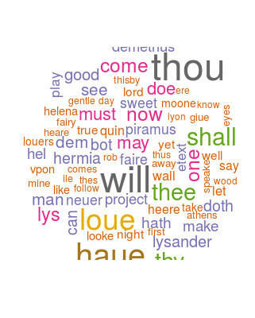

```{r setup, include=FALSE}
knitr::opts_chunk$set(echo = FALSE)
```

## About this project
This presentation describes the Shiny App designed under Week 4 Peer-graded Project's guidelines.  

1. Write a shiny application with associated supporting documentation. The documentation should be thought of as whatever a user will need to get started using your application.  
2. Deploy the application on Rstudio's shiny server.  
3. Share the application link by pasting it into the provided text box.  
4. Share your server.R and ui.R code on github.  

## Links
You can access the Shiny app and the Github repo with the links below:  

- Shiny app  
<https://mkuo.shinyapps.io/ddp_wk4_app/>  

- Github repo  
<https://github.com/mikuo0628/DevDataProd/tree/gh-pages/Week%204%20Assignment>  

## About this Shiny app
Word cloud is an excellent visualization of prevalent words in a body of text and often used to illustrate important or trending ideas based on frequency of appearance.  

In this app, you can paste any text into the designated field and generate a word cloud based on it.

By default, I've inputted the famous Shakespeare play, *A Midsommer Night's Dream*, and generated an example word cloud.

## Example Word Cloud from my app

